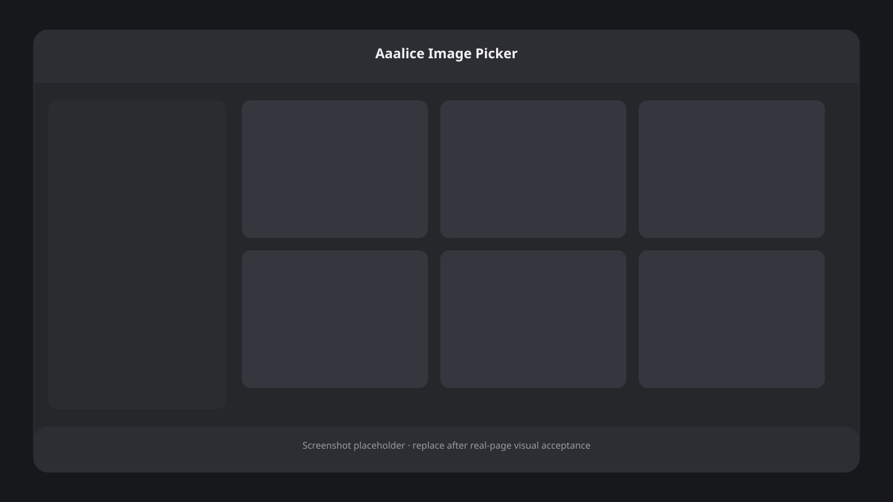

# ComfyUI-Aaalice-Image-Picker

[简体中文](README.md) · [English](README.en.md) · [繁體中文](README.zh-TW.md)

在 ComfyUI 工作流中暂停执行，通过内部模态浮层人工筛选图像批次。适合在高清放大、细化或保存等高成本步骤之前进行人工确认。



## 功能

- 单选与多选均为“选择后确认”，不会因单击直接提交。
- 服务端可信倒计时，以及取消、当前选择、全部、第一张、最后一张五种超时策略。
- 自适应缩略图网格、完整键盘操作和焦点管理。
- 同一浮层内的大图预览，支持鼠标位置锚定缩放（100%–800%）与拖拽平移。
- 可折叠的 CommonMark/GFM Markdown 说明，使用本地 `marked` + `DOMPurify` 安全渲染。
- `en`、`zh`、`zh-TW` 完整界面与节点本地化。
- 刷新或 WebSocket 重连后恢复仍在等待的 session；多客户端和多个选择器相互隔离。

## 安装与更新

安装：

```bash
cd ComfyUI/custom_nodes
git clone https://github.com/Aaalice233/ComfyUI-Aaalice-Image-Picker.git
```

更新：

```bash
cd ComfyUI/custom_nodes/ComfyUI-Aaalice-Image-Picker
git pull
```

重启 ComfyUI 后生效。不需要额外 Python 依赖，也不依赖 CDN。

## 节点接口

节点 ID 为 `AaaliceImagePicker`，位于 `Aaalice/image`，名称为 `🖼️ Aaalice Image Picker`。

| 方向 | 名称 | 类型 | 默认值 | 说明 |
| --- | --- | --- | --- | --- |
| 输入 | `images` | `IMAGE` | 必需 | 需要筛选的图像批次 |
| 输入 | `instructions` | `STRING` | 可选 | 纯输入引脚；连接字符串节点后在浮层中显示 Markdown |
| 输入 | `selection_mode` | `single` / `multiple` | `multiple` | 单选或多选，均需确认 |
| 输入 | `timeout` | `INT` | `300` | 服务端超时秒数，范围 `1–86400` |
| 输入 | `timeout_action` | 见下表 | `cancel` | 倒计时结束时执行的策略 |
| 输出 | `images` | `IMAGE` | — | 按原批次索引升序排列的已选图像；单选保留 batch 维度 |

节点被标记为非幂等，每次排队都会执行人工选择，不会复用缓存跳过。

### 连接 Markdown 说明

使用 ComfyUI 多行字符串节点编写说明，并把它的 `STRING` 输出连接到 `instructions`。例如：

```markdown
## 筛选标准

- [ ] 主体结构完整
- [ ] 光影自然
- [ ] 没有明显伪影

| 优先级 | 检查项 |
| --- | --- |
| 高 | 手部与面部 |
| 中 | 背景细节 |
```

未连接或内容为空时，说明区域完全省略。Markdown 支持标题、段落、强调、列表、任务列表、引用、分隔线、代码块、删除线、表格、链接和图片；危险 HTML、事件属性、内联样式及危险协议会被清除；图片仅允许安全的同源地址，避免打开工作流时自动请求第三方资源。

## 选择与超时

### 选择模式

- `single`：只能保留一张选择；点击另一张会替换当前选择，仍需按“确认选择”。
- `multiple`：可切换任意多张，并可使用“全选”和“清空”。
- 输出始终按原批次索引排序，不按点击顺序排序。

### 超时策略

| 值 | 行为 |
| --- | --- |
| `cancel` | 取消本次执行 |
| `submit_selected` | 提交服务端最后收到的选择；为空时取消 |
| `submit_all` | 提交全部图像 |
| `submit_first` | 提交第一张图像 |
| `submit_last` | 提交最后一张图像 |

倒计时的最终判定来自服务端单调时钟。浏览器标签页被降频、挂起或前端显示延迟不会延长执行期限。

## 鼠标与键盘

### 图库

- 单击缩略图：切换选择。
- 单击缩略图上的放大按钮：进入大图预览。
- 方向键：在缩略图间移动焦点。
- `Space`：切换焦点图像的选择状态。
- `Enter`：打开焦点图像的大图预览。
- `Tab` / `Shift+Tab`：在浮层内循环焦点。
- `Escape`：明确取消并终止本次执行；点击遮罩不会取消。

### 大图预览

- 滚轮：以鼠标对应的图像位置为锚点连续缩放。
- 放大后拖拽：平移图像，边界自动约束。
- `←` / `→`：切换上一张/下一张并复位视图。
- `Space`：切换当前图像选择状态。
- `+` / `-`：放大/缩小。
- `0`：复位到完整适配。
- `Escape`：返回图库，不取消工作流。

## 取消、中断与限制

用户取消、空选择确认、`cancel` 超时、空的 `submit_selected` 或 ComfyUI 中断都会抛出 `InterruptProcessingException`，不会伪造空图像批次。确认、取消、超时与中断发生竞态时，服务端只接受第一个终态。

选择器仅挂载在发起执行的当前 ComfyUI 客户端页面中：不打开独立窗口，不使用 iframe，也不提供重新排队、提示音、蒙版或文本编辑。关闭或离开所有发起执行的客户端页面后，只能等待超时策略或从相同客户端 ID 重连恢复。

## 常见问题

**为什么执行到节点后停住？**
这是预期行为。工作流会等待确认、取消、中断或服务端超时。

**为什么单选没有立即继续？**
单选也必须确认，避免误触导致后续高成本步骤立即执行。

**刷新页面后还能继续吗？**
可以。相同 ComfyUI 客户端 ID 重连后会查询并恢复仍处于等待状态的 session。

**Markdown 能运行 HTML 或脚本吗？**
不能。渲染结果经过显式 allowlist 清洗；外链使用新标签页并带 `noopener noreferrer`。

## 开发验证

```bash
python -m unittest discover -s tests -v
npm test
npm run check
python -m compileall -q .
```

Python 测试应使用安装 ComfyUI 的 Python 环境。

## 许可证

项目代码使用 [MIT License](LICENSE)。本地 vendor 依赖版本见 [`web/vendor/versions.json`](web/vendor/versions.json)：`marked 15.0.11`（MIT）与 `DOMPurify 3.4.12`（MPL-2.0 或 Apache-2.0）；完整第三方许可证位于 [`web/vendor/`](web/vendor/)。
